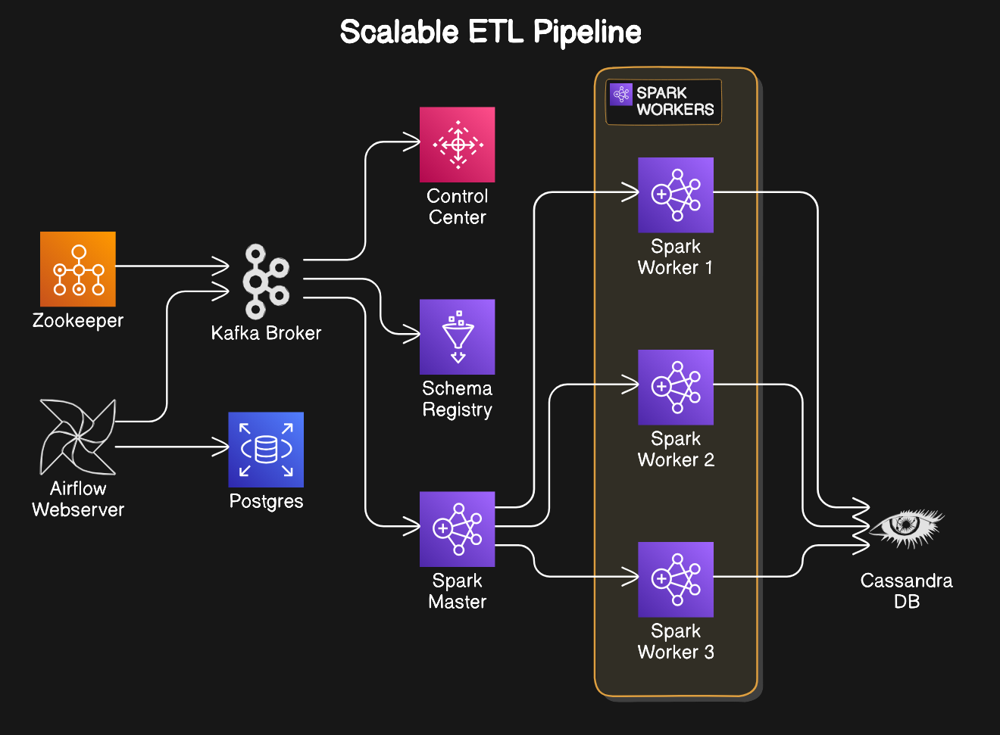

# Real-Time Data Streaming: Scalable ETL Pipeline

## Overview

This project is a **Scalable ETL (Extract, Transform, Load) Pipeline** designed for real-time data streaming and processing. It leverages a distributed architecture to handle large data streams, ensuring fault-tolerance, scalability, and performance. The core components include Apache Kafka for message streaming, Apache Spark for data processing, Airflow for orchestration, and Cassandra for storing transformed data.

The pipeline is containerized using Docker and orchestrated with Docker Compose for seamless deployment and scalability.

## Architecture

The architecture consists of several key components, each responsible for a specific part of the ETL process:



### Component Breakdown

- **Zookeeper**: Manages and coordinates Kafka brokers.
- **Kafka Broker**: Streams real-time messages for the pipeline.
- **Schema Registry**: Manages the schema of the data flowing through Kafka topics.
- **Airflow**: Manages workflows, orchestrating tasks like starting and stopping jobs.
- **Spark Master & Workers**: Handles the transformation and processing of large datasets in parallel.
- **Postgres**: Stores metadata related to the jobs and their statuses.
- **Cassandra**: Stores the transformed data in a distributed NoSQL database.

## Setup Instructions

### Prerequisites

- Docker and Docker Compose must be installed on your machine.

### Step-by-Step Setup

1. **Clone the repository**:

   ```bash
   git clone https://github.com/Sarath191181208/real_time_data_streaming
   cd real_time_data_streaming
   ```

2. **Start the services**:

   Use Docker Compose to bring up the entire pipeline.

   ```bash
   docker-compose up
   ```

3. **Accessing Services**:
   - **Airflow Webserver**: Visit `http://localhost:8080` to view the Airflow UI.
   - **Kafka Control Center**: Visit `http://localhost:9021` for Kafka's Control Center.

4. **Create and Monitor Jobs**:

   Use Airflow to create and manage your ETL jobs. Kafka will stream data to Spark for processing, and the results will be stored in Cassandra.

### Stopping the Services

To stop and remove the containers:

```bash
docker-compose down
```

## Application Details

- **Real-Time Streaming**: Kafka streams data in real-time, ensuring that high-throughput data can be ingested and processed efficiently.
- **Distributed Processing**: Spark processes the data in parallel, enabling transformations at scale.
- **Orchestrated Workflows**: Airflow handles the scheduling and execution of ETL jobs, ensuring that tasks are performed in the correct order.
- **Fault-Tolerant Storage**: Cassandra provides a highly scalable, distributed database solution for storing the final transformed data.

## Future Enhancements

- Add monitoring and alerting for better pipeline observability.
- Implement more data sources and sinks, such as AWS S3, Google BigQuery, etc.
- Integrate security features like authentication and authorization for different components.

## License

This project is licensed under the MIT License. See the `LICENSE` file for more details.

---

Feel free to contribute or raise issues if you encounter any problems!
